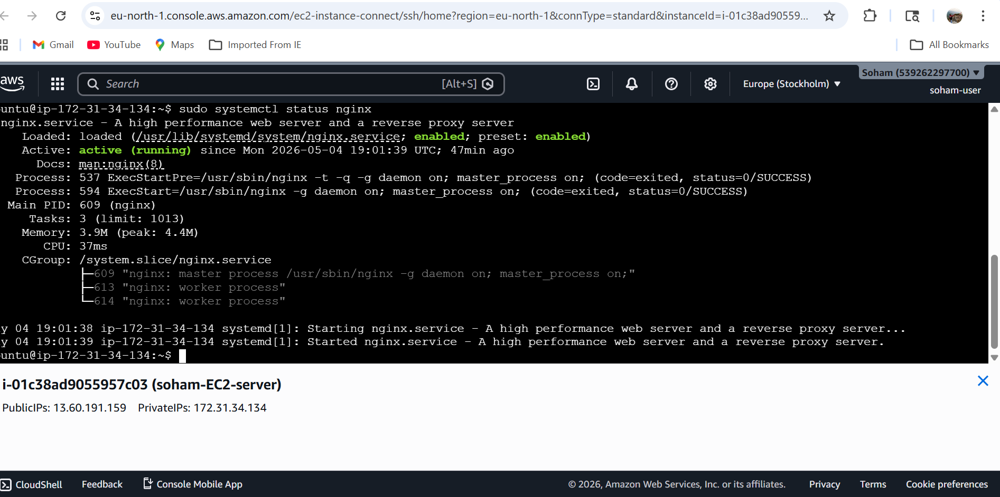
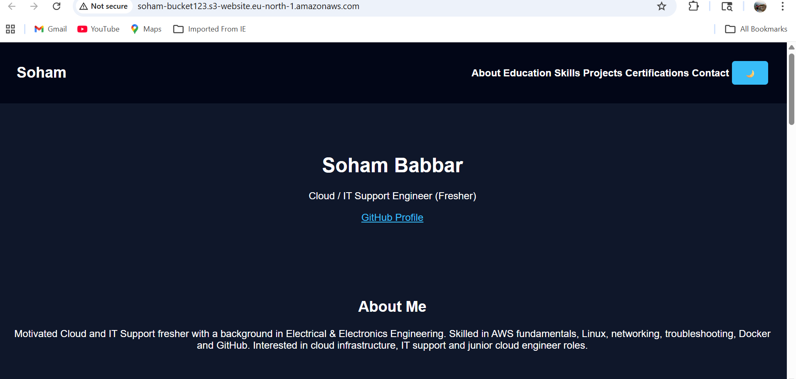

# Linux Web Server Deployment on AWS EC2

## 📌 Project Overview

Provisioned an AWS EC2 Linux instance and deployed a web application using Nginx.

## 🚀 Technologies Used

* AWS EC2
* Linux (Ubuntu)
* Nginx
* HTML, CSS, JavaScript

## ⚙️ Implementation Steps

1. Launched EC2 instance
2. Connected via SSH
3. Installed Nginx web server
4. Configured security group (Port 80)
5. Deployed website files (index.html, CSS, JS)

## 🌐 Live Website

http://13.60.191.159

## 📸 Screenshots

### EC2 Instance

### Nginx Running

### Website Output

